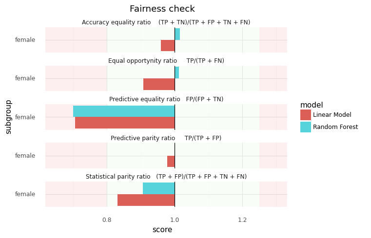

# [dev] python-fairmodels
A Python adaptation from the R package [fairmodels](https://github.com/ModelOriented/fairmodels).

## Installation
First clone this repository:
```shell
git clone https://github.com/Locust2520/python-fairmodels
cd python-fairmodels
```

Then install requirements:
```shell
pip install -r requirements
```

## Getting started
For the moment, you can only test the module at the root of the repository.  
Run `example.py` to see an example usage:

```python
import pandas as pd
import numpy as np
from fairmodels import *
from fairmodels.plotnine import *

# ~~~~~~~~~~~~~~~~~~~ loading the german dataset ~~~~~~~~~~~~~~~~~~~ #

german = pd.read_csv("test/german.csv")
y = (german.Risk == "good").astype(np.float)

# ~~~~~~~~~~~~~~~~~~~ loading models predictions ~~~~~~~~~~~~~~~~~~~ #

predictions = pd.read_csv("test/pred.csv")
lm = ModelProb(preds=predictions["lm"], threshold=0.5, name="Linear Model")
rf = ModelProb(preds=predictions["rf"], threshold=0.5, name="Random Forest")

# ~~~~~~~~~~~~~~~~~~~~~~~~ fairness checking ~~~~~~~~~~~~~~~~~~~~~~~ #

fobject = FairnessObject(
    model_probs=[lm, rf],
    y=y,
    protected=german.Sex,
    privileged="male"
)
plt = fobject.plot()
plt += theme_minimal()  # changing the theme
plt.show()
plt.save("graphic.png")
```

That should output this figure:


`fairmodels` embeds a modified version of [plotnine](https://github.com/has2k1/plotnine), which allows to plot
ggplot2-like graphics with a very similar grammar.
